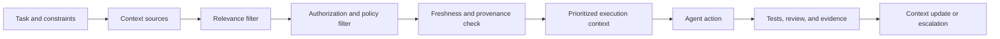

Prompt engineering became popular because it made a new interface feel controllable. Change the instruction, change the output. Add a role, an example, or a constraint. Ask the model to think step by step. The techniques are useful, but they describe only one layer of the problem.

A prompt is an instruction. Context is the operating state from which the system produces an answer.

That state may include the task, the relevant code, previous decisions, tool results, permissions, user identity, time-sensitive data, memory, output constraints, and evidence from earlier attempts. It may also include irrelevant or contradictory material. The system's reliability depends on what enters the context, what is excluded, how the information is ordered, and whether the result can be checked.

The engineering problem is therefore not “How do I write the perfect prompt?” It is “How do I construct the smallest sufficient context for this decision, under the right authority, with evidence that it is still valid?”

## A prompt cannot compensate for missing state

Imagine asking an agent to fix a repository issue with a precise instruction but no access to the failing test, the relevant module, the runtime configuration, or the project's conventions. The prompt can be excellent. The agent is still operating without the state required to act safely.

The opposite failure is equally common: provide the entire repository, every historical document, all previous conversations, and broad tool access. The agent now has more material but not necessarily more understanding. Important constraints are buried. Old decisions look current. Sensitive data crosses a boundary. Contradictions are resolved by guesswork.

More context is not automatically better context.

## The context stack

A useful context model has several layers:

| Layer | Function | Typical failure |
| --- | --- | --- |
| Task | States the desired outcome and stopping condition | Vague goal or missing scope |
| Domain | Explains terms, invariants, and business constraints | Technically correct but wrong result |
| System | Provides code, schemas, configuration, and dependencies | Wrong version or incomplete path |
| History | Supplies decisions, incidents, and prior attempts | Stale context treated as current |
| Tools | Allows reads, tests, changes, or external actions | Authority exceeds the task |
| Evidence | Shows whether the result works | Assertion mistaken for proof |

These layers interact. A task may require a production-safe change, but the available tool permission may allow only a local test. A code file may look correct, but a historical migration may reveal an invariant that the file does not state. A tool result may be accurate but stale by the time the agent acts.

Context engineering is the discipline of making these relationships explicit.

## Selection is a security and reliability decision

Context selection is often described as a relevance problem: retrieve the documents most related to the question. In production, it is also an authorization problem.

The relevant document is not necessarily a permitted document. A user may be allowed to ask for a summary without being allowed to expose the source records. An agent may need a schema but not the values stored in the table. A reviewer may need the diff and tests but not a production credential.

The selection pipeline should therefore answer two independent questions:

1. Is this information useful for the task?
2. Is this information allowed to enter this execution context?

If the second question is implicit, the system is relying on the model to infer a security boundary. That is not a safe architecture.

## Freshness is part of meaning

Context can be accurate and still be wrong for the current decision because it is old.

A document describing a service's ownership may have been correct six months ago. A cached API response may no longer represent the provider's current state. A previous agent attempt may have modified the repository. A memory entry may be useful history but not a current instruction.

Every context source needs an appropriate freshness policy:

- immutable history can be retained as evidence;
- architectural decisions should carry a status and review date;
- operational state should be fetched close to execution;
- generated summaries should point to their source and generation time;
- credentials and permissions should be evaluated at action time.

“Retrieved” is not the same as “current.”

## Ordering shapes interpretation

When context contains conflicting material, the order in which it is presented affects what the model treats as authoritative. This is not an argument for hiding ambiguity. It is an argument for representing authority explicitly.

Put current task constraints where the runtime can distinguish them from historical examples. Label decisions, hypotheses, observations, and instructions differently. Preserve the source and timestamp of retrieved information. When two sources conflict, surface the conflict instead of concatenating both and hoping the model chooses correctly.

The system should make it easy for a human reviewer to answer: which input caused this action?

## Context budgets require prioritisation

Context windows are finite, even when the interface makes them feel large. When the available state exceeds the budget, something will be truncated, summarised, or omitted.

That policy must be designed rather than left to an arbitrary limit. A safe prioritisation order may be:

1. hard constraints and authorization;
2. the current task and success criteria;
3. relevant interfaces and invariants;
4. current observations and tool results;
5. recent decisions and known failure modes;
6. background explanation and historical detail.

The exact order varies by domain. The important invariant is that a summary must not silently remove the condition that makes an action safe.

Compression also needs provenance. A short summary is not equivalent to the source unless the system can recover the source or prove that the omitted detail is irrelevant to the decision.

## Useful, ambiguous, and dangerous context

Not all context failures look the same.

**Useful context** is relevant, current enough for the task, within scope, and linked to an observable fact. It reduces uncertainty.

**Ambiguous context** contains multiple interpretations, stale decisions, or missing ownership. It should trigger a question, an explicit assumption, or a human gate.

**Dangerous context** grants authority beyond the task, includes sensitive data unnecessarily, or encourages an irreversible action without evidence. It should be blocked or quarantined by the runtime.

The model should not be the only component deciding which category applies. Policy belongs in the surrounding system: tool permissions, retrieval filters, redaction, task scopes, and approval states.

## Agents turn context into a control loop

An agent is not reliable because it can produce a good answer once. It is reliable when its loop is bounded:

- it observes a defined state;
- it receives only the context and authority required;
- it takes an action with a measurable effect;
- it checks evidence against a completion condition;
- it stops, retries within policy, or escalates.

This is where context engineering meets software architecture. The agent needs idempotency, timeouts, bounded retries, audit logs, and clear ownership just like any other distributed workflow. A prompt can explain the desired behavior, but it cannot enforce the runtime contract by itself.

The same applies to human gates. “Ask for approval” is not a reliable control if the approval request omits the diff, the affected resources, the tests, and the action's reversibility. The gate must receive enough context to make a decision without reconstructing the entire task.

## Evaluation must test context, not only answers

Most AI evaluations focus on the final text. That misses failures in retrieval and authority.

Useful evaluations should ask:

- Did the system retrieve the required source?
- Did it exclude data outside the task's permission scope?
- Did it use the current version rather than a stale document?
- Did it identify contradictory evidence?
- Did it stop when the context was insufficient?
- Did it cite or preserve the source of a consequential claim?
- Did it execute only the tools allowed by the task?

An agent that answers correctly for the wrong reason is not reliable. A system that declines safely when the context is incomplete may be more valuable than one that always produces a plausible response.

## Context is an interface between systems and people

The context supplied to an agent is also the context supplied to the next human reviewer. If the system cannot explain which facts, constraints, and permissions shaped the output, the review becomes a second attempt to reconstruct the task.

That is why context should be treated as an observable artifact. Record the selected sources, versions, tool calls, policy decisions, and evidence. The level of detail should reflect risk, but a consequential action should never be a black box simply because the model produced it fluently.

## Limits of context engineering

Good context cannot repair a missing business decision. It cannot make an unreliable source authoritative. It cannot remove the need for a domain expert when the consequence of error is high.

There is also a real cost to assembling and storing context: latency, token usage, retrieval complexity, privacy exposure, and operational debugging. The answer is not to include everything. It is to define the minimum sufficient state for each class of task and measure whether that state produces reliable outcomes.

Finally, context does not eliminate model uncertainty. It changes the conditions under which uncertainty is detected and managed.

## Beyond the prompt

Prompt engineering remains useful. Clear instructions, examples, and output formats improve a system. They are just not the system.

The production question is broader: what should the agent know, what is it allowed to know, how current is that knowledge, what can it do, how will we know it worked, and what happens when the answer is not supported by the available evidence?

Those are context engineering questions. They are also architecture questions.

## Series navigation

- Part 1 — [Unknown Unknowns in Software Architecture](../posts/unknown-unknowns-software-architecture).
- Part 2 — [Building Self-Service Analytics That Doesn't Lie](../posts/self-service-analytics-that-doesnt-lie).
- Part 3 (current) — Context Engineering Beyond Prompt Engineering.
- Part 4 — [Why Most Engineering Documents Age Poorly](../posts/engineering-documents-age-poorly).

Related reading: [AI at RockFi](../posts/ai-human-judgment-rockfi), [Engineering in 2026](../posts/engineering-2026-ai-redefined-our-job), and [Claude Code and the Product OS](../posts/claude-code-product-os).
