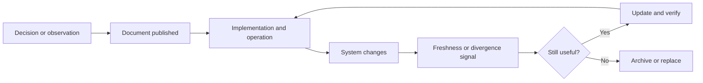

Most engineering teams do not suffer from a complete absence of documentation. They suffer from documents that look authoritative after the system has moved on.

The page still exists. The diagram still renders. The instructions still contain plausible commands. A new engineer follows it and gets a result that is almost correct, or an operator makes a change based on a boundary that no longer exists. The document did not disappear. It became more dangerous because it retained the appearance of current knowledge.

I have seen this pattern often enough to distrust a beautifully formatted page with no owner or date. Nothing projects authority quite like a runbook referencing a script deleted eighteen months ago.

Documentation ages poorly when it is treated as a finished artifact rather than as a maintained interface between decisions, systems, and people.

## A document has a lifecycle (even if the wiki pretends otherwise)

The moment a document is published, the surrounding system begins to change. A provider changes a response. A team changes ownership. A schema gains a new state. A deployment process removes a manual step. A decision that was reasonable under one constraint becomes wrong under another.

The document now has a lifecycle:

1. context is gathered;
2. a decision or explanation is written;
3. the system is implemented;
4. the system changes;
5. the document either receives a new signal or silently diverges;
6. someone trusts, repairs, or archives it.

The problem is not that change occurs. The problem is that most documentation systems make publication visible but divergence invisible.

## Not all documents should be maintained the same way

One reason documentation programs become expensive is that they apply one lifecycle to fundamentally different artifacts.

### Decision records

A decision record explains why a choice was made, which alternatives were rejected, and which constraints mattered. It should remain historically accurate even after the implementation changes. Its status can become superseded, but its original reasoning should not be rewritten to match the present.

### Contracts

An API contract, event schema, metric definition, or permission rule describes what other systems are allowed to rely on. It needs an owner, versioning, compatibility expectations, and tests. A stale contract is not merely unhelpful; it can cause data corruption or an invalid integration.

### Operational guides

A runbook is an instruction for a person operating the current system. It needs executable commands, failure conditions, access requirements, and a review signal. If the command no longer works, the document has failed its primary purpose.

### Generated reference

Reference generated from code, schemas, or configuration should not pretend to be human-authored narrative. Its value comes from being regenerated from a source of truth, with clear generation time and version.

### Historical narrative

A post-mortem or project narrative can remain useful after its implementation details are obsolete because its purpose is to preserve reasoning and learning. It should be dated and labelled as history rather than presented as current operating guidance.

The first question when editing a document is therefore not “Is this still true?” It is “What kind of truth is this document supposed to preserve?”

## Why drift is structurally normal

Documentation drift is not usually caused by careless engineers. It is the predictable result of weak incentives and missing connections.

- The person who writes the document may not own the system later.
- The change workflow may not identify which documents are affected.
- The document may be stored far from the code, schema, or decision that can reveal divergence.
- Updating prose competes with shipping the change that made the prose wrong.
- Readers cannot see whether the document was checked recently.
- Generated output is copied into a page without a source or regeneration path.
- A document may contain both permanent reasoning and temporary instructions, so no one knows what should be updated.

Telling teams to “keep docs up to date” does not address these conditions. It is the documentation equivalent of asking a distributed system to “please be consistent.” The system needs a smaller, more explicit contract.

## The durable document contract

An engineering document that matters should expose:

| Field | Purpose |
| --- | --- |
| Scope | What system, decision, or workflow does it cover? |
| Status | Draft, active, superseded, deprecated, or historical? |
| Owner | Who can confirm whether it remains useful? |
| Sources | Which code, schemas, decisions, or incidents support it? |
| Effective date | From when does the described state apply? |
| Freshness signal | What change should trigger review? |
| Dependencies | Which systems or teams can invalidate it? |
| Exit condition | When should it be archived or replaced? |

This may look like metadata, but it determines how a reader should interpret the content. A document without status or date forces every reader to guess whether it is current.

## Link documents to change, not only to folders

A folder hierarchy is a weak relationship. A document may sit next to a service while describing a workflow that crosses five other systems. The useful relationship is to the change that can invalidate it.

Examples include:

- an event contract linked to the producer and consumer tests;
- a metric definition linked to its model and reconciliation check;
- a runbook linked to the deployment or alert it supports;
- an architecture decision linked to the issue, migration, and rollout that implemented it;
- an agent workflow linked to its tools, permission policy, and evaluation cases.

This does not mean every document needs an elaborate graph. It means the important edges should be explicit enough for a change reviewer to ask, “Which knowledge needs to move with this change?”

## Generated documentation is not automatically current (sorry, robots)

Generation is valuable when the source is authoritative and the output is deterministic. It is not a substitute for ownership.

A generator can faithfully describe the current code while omitting why the code exists, which constraints are intentional, or which behaviour is unsafe to change. It can also produce a polished document from a stale checkout or an incorrect configuration.

The right contract for generated material includes:

- the source of truth;
- the generation command or workflow;
- the version or commit used;
- the parts that are generated and the parts that require human explanation;
- a validation step that confirms the output matches the intended boundary.

Human review remains necessary when documentation communicates a decision, a risk, or an operational consequence.

## A document should be allowed to expire

Teams often avoid marking documents as obsolete because deletion feels like losing knowledge. The result is a library where current guidance competes with historical fragments and abandoned proposals.

Expiration is not destruction. Archive the document with its status, date, and reason. Link to the replacement when one exists. Preserve historical decisions where they explain the path to the present, but remove them from the default path for someone operating the system today.

An explicit “superseded” state is safer than silently leaving two contradictory documents active.

## Review at the moment of change

The best time to review documentation is when the system changes, not when an annual documentation audit appears on a calendar.

For a meaningful change, ask:

- Which contract, decision, runbook, or reference does this invalidate?
- Does the document describe current behaviour or historical reasoning?
- Can a reader tell which version and environment it applies to?
- Is the owner still the right owner?
- Should the document be updated, regenerated, split, superseded, or archived?
- What test or check can prevent the same drift next time?

This turns documentation into part of the change boundary. It also keeps the review proportional: a generated endpoint reference may need regeneration, while a security or data ownership decision may need a new human approval.

## The relationship with AI-assisted engineering

AI can reduce the cost of creating and updating documentation, but it also increases the amount of plausible text a team can produce. That makes source discipline more important.

An agent can inspect a repository, reconstruct a workflow, draft a design document, and identify contradictions faster than a person starting from a blank page. It can also confidently summarise stale material or fill an unknown gap with a reasonable invention.

That second output often looks excellent. This is not reassuring.

The safe workflow is evidence-first:

1. identify the document type and its intended audience;
2. gather current sources and label historical material;
3. separate observed behaviour from interpretation and proposal;
4. generate the draft with links to its evidence;
5. have an owner validate the decision or instruction;
6. record the status and the next freshness signal.

The objective is not to make documentation sound authoritative. It is to make the authority inspectable.

## A practical maintenance policy

For each document, choose one primary policy:

- **Maintain:** a human owner reviews it when defined changes occur.
- **Generate:** a source-of-truth workflow regenerates it automatically.
- **Verify:** tests or checks continuously validate its critical claims.
- **Archive:** it preserves history but is excluded from current guidance.
- **Delete:** it has no remaining decision or operational value.

Many documents need a combination. A runbook may be maintained by a team, verified by a smoke test, and archived when a service is retired. A decision record may be maintained only for status and links while its reasoning remains immutable.

The mistake is not choosing the wrong policy once. The mistake is having no policy and expecting future readers to infer one.

## Limits of documentation

Documentation cannot compensate for an unclear architecture, an absent owner, or a business decision nobody has made. Writing down ambiguity does not resolve it.

Nor should every implementation detail become a permanent document. Some knowledge is better represented by executable tests, schemas, code comments, dashboards, or generated reference. The correct medium is the one that keeps the claim closest to the signal that can invalidate it.

Finally, freshness is not the same as truth. A document can be reviewed yesterday and still describe a bad decision. Review confirms alignment with the current system; it does not replace engineering judgment.

## The document is part of the system

An engineering document is an interface. It tells a person or another system what to assume, what to do, and what to question. Like any interface, it needs a scope, an owner, a compatibility story, and a way to detect when it no longer matches reality.

The durable document is not the longest one or the most beautifully formatted one. It is the one whose status is clear, whose evidence is reachable, whose owner can be found, and whose disappearance would be detected before it causes harm.

Good documentation does not try to stop the system from changing. It helps the organization change without losing the decisions and constraints that still matter.

## Series navigation

- Part 1 — [Unknown Unknowns in Software Architecture](../posts/unknown-unknowns-software-architecture).
- Part 2 — [Building Self-Service Analytics That Doesn't Lie](../posts/self-service-analytics-that-doesnt-lie).
- Part 3 — [Context Engineering Beyond Prompt Engineering](../posts/context-engineering-beyond-prompt-engineering).
- Part 4 (current) — Why Most Engineering Documents Age Poorly.

Related reading: [Engineering in 2026](../posts/engineering-2026-ai-redefined-our-job), [Claude Code and the Product OS](../posts/claude-code-product-os), and [The Day Redis Reached its Limits](../posts/redis-memory-exhaustion-post-mortem).
