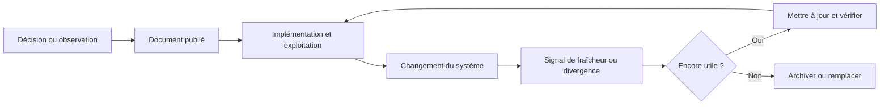

La plupart des équipes d'ingénierie ne souffrent pas d'une absence totale de documentation. Elles souffrent de documents qui semblent faire autorité alors que le système a continué à évoluer.

La page existe toujours. Le diagramme se rend toujours. Les instructions contiennent encore des commandes plausibles. Un nouvel ingénieur les suit et obtient un résultat presque correct, ou un opérateur modifie un système à partir d'une frontière qui n'existe plus. Le document n'a pas disparu. Il est devenu plus dangereux parce qu'il conserve l'apparence d'une connaissance actuelle.

J'ai vu ce scénario suffisamment souvent pour me méfier d'une page magnifiquement formatée sans owner ni date. Rien ne projette autant d'autorité qu'un runbook pointant vers un script supprimé depuis dix-huit mois.

La documentation vieillit mal lorsqu'elle est traitée comme un artefact terminé plutôt que comme une interface maintenue entre les décisions, les systèmes et les personnes.

## Un document possède un cycle de vie (même si le wiki prétend le contraire)

<ArticleDiagram visualId="engineering-documents-age-poorly" />

Dès qu'un document est publié, le système autour commence à changer. Un fournisseur modifie une réponse. Une équipe change d'ownership. Un schéma gagne un nouvel état. Un processus de déploiement supprime une étape manuelle. Une décision raisonnable sous une contrainte devient incorrecte sous une autre.

Le document possède alors un cycle de vie :

1. le contexte est rassemblé ;
2. une décision ou une explication est écrite ;
3. le système est implémenté ;
4. le système change ;
5. le document reçoit un signal de divergence ou reste silencieux ;
6. quelqu'un lui fait confiance, le répare ou l'archive.

Le problème n'est pas que le changement existe. C'est que la plupart des systèmes de documentation rendent la publication visible mais la divergence invisible.

## Tous les documents ne se maintiennent pas de la même manière

Une raison pour laquelle les programmes de documentation deviennent coûteux est qu'ils appliquent le même cycle de vie à des artefacts fondamentalement différents.

### Les décisions d'architecture

Une décision explique pourquoi un choix a été fait, quelles alternatives ont été rejetées et quelles contraintes comptaient. Elle doit rester historiquement exacte même lorsque l'implémentation change. Son statut peut devenir « remplacée », mais son raisonnement original ne doit pas être réécrit pour correspondre au présent.

### Les contrats

Un contrat d'API, de schéma d'événement, de définition de métrique ou de permission décrit ce sur quoi les autres systèmes peuvent compter. Il a besoin d'un owner, d'un versioning, d'attentes de compatibilité et de tests. Un contrat obsolète n'est pas seulement inutile : il peut provoquer une corruption de données ou une intégration incorrecte.

### Les guides opérationnels

Un runbook est une instruction destinée à une personne qui opère le système actuel. Il doit contenir des commandes exécutables, des conditions d'échec, les accès nécessaires et un signal de revue. Si la commande ne fonctionne plus, le document a échoué dans son objectif principal.

### Les références générées

Une référence générée depuis du code, des schémas ou de la configuration ne doit pas se faire passer pour un récit écrit par un humain. Sa valeur vient de sa génération depuis une source de vérité, avec une date et une version claires.

### Les récits historiques

Un post-mortem ou un récit de projet peut rester utile lorsque ses détails d'implémentation sont obsolètes, car son objectif est de préserver un raisonnement et un apprentissage. Il doit être daté et présenté comme de l'histoire, pas comme une instruction d'exploitation actuelle.

La première question lorsqu'on édite un document n'est donc pas « est-il encore vrai ? ». C'est « quel type de vérité ce document doit-il préserver ? »

## Pourquoi la dérive est structurellement normale

La dérive documentaire n'est généralement pas causée par des ingénieurs négligents. Elle résulte de mauvaises incitations et de connexions absentes.

- La personne qui écrit le document ne possède peut-être plus le système plus tard.
- Le workflow de changement n'identifie pas les documents affectés.
- Le document est stocké loin du code, du schéma ou de la décision qui pourrait révéler la divergence.
- Mettre à jour la prose entre en concurrence avec la livraison du changement qui l'a rendue fausse.
- Les lecteurs ne voient pas si le document a été vérifié récemment.
- Une sortie générée est copiée dans une page sans source ni chemin de régénération.
- Un document mélange raisonnement permanent et instruction temporaire, donc personne ne sait ce qui doit être mis à jour.

Dire aux équipes de « garder la doc à jour » ne traite aucune de ces conditions. C'est l'équivalent documentaire de demander à un système distribué d'« être cohérent, s'il te plaît ». Le système a besoin d'un contrat plus petit et plus explicite.

## Le contrat d'un document durable

Un document d'ingénierie important devrait exposer :

| Champ | Objectif |
| --- | --- |
| Scope | Quel système, quelle décision ou quel workflow couvre-t-il ? |
| Statut | Brouillon, actif, remplacé, déprécié ou historique ? |
| Owner | Qui peut confirmer qu'il reste utile ? |
| Sources | Quel code, schéma, décision ou incident le soutient ? |
| Date d'effet | À partir de quand l'état décrit s'applique-t-il ? |
| Signal de fraîcheur | Quel changement doit déclencher une revue ? |
| Dépendances | Quels systèmes ou équipes peuvent l'invalider ? |
| Condition de sortie | Quand doit-il être archivé ou remplacé ? |

Cela ressemble à des métadonnées, mais ces éléments déterminent comment le lecteur doit interpréter le contenu. Un document sans statut ni date oblige chaque lecteur à deviner s'il est actuel.

## Relier les documents aux changements, pas seulement aux dossiers

Une arborescence est une relation faible. Un document peut être placé à côté d'un service tout en décrivant un workflow qui traverse cinq autres systèmes. La relation utile est celle avec le changement susceptible de l'invalider.

Par exemple :

- un contrat d'événement relié aux tests du producteur et des consommateurs ;
- une définition de métrique reliée à son modèle et à son contrôle de réconciliation ;
- un runbook relié au déploiement ou à l'alerte qu'il accompagne ;
- une décision d'architecture reliée à l'issue, à la migration et au rollout qui l'ont implémentée ;
- un workflow agentique relié à ses outils, sa policy de permission et ses cas d'évaluation.

Chaque document n'a pas besoin d'être un graphe complexe. Les relations importantes doivent simplement être explicites pour qu'un reviewer puisse demander : « Quelles connaissances doivent bouger avec ce changement ? »

## Une documentation générée n'est pas automatiquement actuelle (désolé, les robots)

La génération est utile lorsque la source est autoritaire et que la sortie est déterministe. Elle ne remplace pas l'ownership.

Un générateur peut décrire fidèlement le code actuel tout en omettant pourquoi il existe, quelles contraintes sont intentionnelles ou quels comportements sont dangereux à modifier. Il peut aussi produire un document élégant depuis un checkout obsolète ou une mauvaise configuration.

Le contrat d'un document généré doit inclure :

- la source de vérité ;
- la commande ou le workflow de génération ;
- le commit ou la version utilisés ;
- les parties générées et les parties qui demandent une explication humaine ;
- une validation qui confirme que la sortie respecte la frontière attendue.

La revue humaine reste nécessaire lorsque la documentation communique une décision, un risque ou une conséquence opérationnelle.

## Un document doit pouvoir expirer

Les équipes hésitent souvent à marquer un document comme obsolète parce que la suppression donne l'impression de perdre de la connaissance. Le résultat est une bibliothèque où des conseils actuels sont en concurrence avec des fragments historiques et des propositions abandonnées.

L'expiration n'est pas la destruction. Archiver un document avec son statut, sa date et sa raison. Pointer vers le remplacement lorsqu'il existe. Préserver les décisions historiques lorsqu'elles expliquent le chemin vers le présent, mais les retirer du parcours par défaut de la personne qui opère le système aujourd'hui.

Un état explicite « remplacé » est plus sûr que de laisser silencieusement deux documents contradictoires actifs.

## Revoir au moment du changement

Le meilleur moment pour revoir la documentation est celui où le système change, pas celui où un audit annuel de documentation apparaît dans le calendrier.

Pour un changement significatif, demander :

- Quel contrat, quelle décision, quel runbook ou quelle référence ce changement invalide-t-il ?
- Le document décrit-il le comportement actuel ou un raisonnement historique ?
- Le lecteur peut-il voir la version et l'environnement concernés ?
- L'owner est-il toujours le bon owner ?
- Faut-il mettre à jour, régénérer, découper, remplacer ou archiver le document ?
- Quel test ou contrôle peut empêcher cette dérive la prochaine fois ?

La documentation devient alors une partie de la frontière de changement. La revue reste proportionnée : une référence d'endpoints générée peut nécessiter une régénération, tandis qu'une décision de sécurité ou d'ownership data peut nécessiter une nouvelle approbation humaine.

## Le lien avec l'ingénierie assistée par IA

L'IA peut réduire le coût de création et de mise à jour de la documentation, mais elle augmente aussi la quantité de texte plausible qu'une équipe peut produire. La discipline sur les sources devient donc plus importante.

Un agent peut inspecter un repository, reconstruire un workflow, rédiger un design document et repérer des contradictions plus vite qu'une personne partant d'une page blanche. Il peut aussi résumer avec assurance des informations obsolètes ou combler un trou par une invention raisonnable.

Le second résultat est souvent très bien écrit. Ce n'est pas rassurant.

Un workflow sûr commence par les preuves :

1. identifier le type de document et son audience ;
2. rassembler les sources actuelles et étiqueter les éléments historiques ;
3. séparer le comportement observé, l'interprétation et la proposition ;
4. générer le brouillon avec des liens vers ses preuves ;
5. faire valider la décision ou l'instruction par un owner ;
6. enregistrer le statut et le prochain signal de fraîcheur.

L'objectif n'est pas de rendre la documentation autoritaire dans sa formulation. C'est de rendre son autorité inspectable.

## Une politique pratique de maintenance

Pour chaque document, choisir une politique principale :

- **Maintenir :** un owner humain le revoit lorsque certains changements surviennent.
- **Générer :** un workflow depuis la source de vérité le régénère automatiquement.
- **Vérifier :** des tests ou contrôles valident continuellement ses affirmations critiques.
- **Archiver :** il préserve l'histoire mais est exclu des instructions actuelles.
- **Supprimer :** il n'a plus de valeur décisionnelle ni opérationnelle.

Beaucoup de documents combinent plusieurs politiques. Un runbook peut être maintenu par une équipe, vérifié par un smoke test et archivé lorsqu'un service est retiré. Une décision peut ne conserver qu'un statut et des liens tout en gardant son raisonnement immuable.

L'erreur n'est pas de choisir la mauvaise politique une fois. L'erreur est de ne pas avoir de politique et d'attendre des futurs lecteurs qu'ils la déduisent.

## Les limites de la documentation

La documentation ne peut pas compenser une architecture floue, un owner absent ou une décision métier qui n'a jamais été prise. Écrire l'ambiguïté ne la résout pas.

Tous les détails d'implémentation ne doivent pas non plus devenir des documents permanents. Certains sont mieux représentés par des tests exécutables, des schémas, des commentaires de code, des dashboards ou une référence générée. Le bon support est celui qui garde l'affirmation proche du signal capable de l'invalider.

Enfin, la fraîcheur n'est pas la vérité. Un document peut avoir été revu hier et décrire quand même une mauvaise décision. La revue confirme l'alignement avec le système courant ; elle ne remplace pas le jugement d'ingénierie.

## Le document fait partie du système

Un document d'ingénierie est une interface. Il indique à une personne ou à un autre système ce qu'il peut supposer, ce qu'il doit faire et ce qu'il doit questionner. Comme toute interface, il a besoin d'un scope, d'un owner, d'une histoire de compatibilité et d'un moyen de détecter qu'il ne correspond plus à la réalité.

Le document durable n'est pas le plus long ni le mieux formaté. C'est celui dont le statut est clair, dont les preuves sont accessibles, dont l'owner est identifiable et dont la disparition serait détectée avant de causer un dommage.

Une bonne documentation n'empêche pas le système de changer. Elle permet à l'organisation de changer sans perdre les décisions et les contraintes qui comptent encore.

## Navigation dans la série

- Partie 1 — [Les inconnus inconnus de l'architecture logicielle](../posts/unknown-unknowns-software-architecture).
- Partie 2 — [Construire un self-service analytics qui ne ment pas](../posts/self-service-analytics-that-doesnt-lie).
- Partie 3 — [L'ingénierie du contexte au-delà du prompt engineering](../posts/context-engineering-beyond-prompt-engineering).
- Partie 4 (actuelle) — Pourquoi la plupart des documents d'ingénierie vieillissent mal.

À lire aussi : [L'ingénierie en 2026](../posts/engineering-2026-ai-redefined-our-job), [Claude Code et le Product OS](../posts/claude-code-product-os) et [Le jour où Redis a atteint ses limites](../posts/redis-memory-exhaustion-post-mortem).
