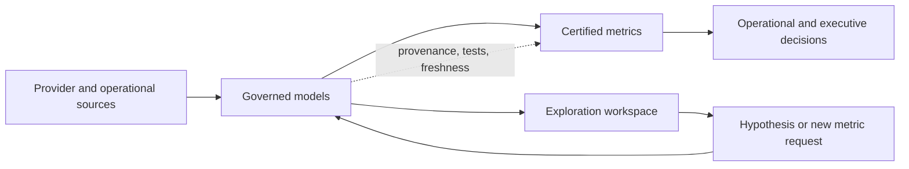

Self-service analytics has an attractive promise: give teams access to the data, let them answer their own questions, and reduce the queue for the data team.

The promise fails when “access” is confused with “understanding.” A dashboard can load successfully, use a valid SQL query, and still communicate a false number. The failure is usually silent. No exception is raised when a join multiplies rows, a provider sends late data, a timezone changes the reporting day, or two teams use the word “revenue” for different populations.

The problem is not primarily the visualization tool. It is the absence of a contract around the metric.

Self-service analytics becomes reliable when people are free to explore but the organization is explicit about which definitions, grains, sources, and quality signals are safe to use for decisions.

## Available data is not trustworthy data

There are at least four different questions hidden inside “Can I get this number?”

1. Does a source contain records related to the question?
2. Can those records be transformed into the requested grain?
3. Is the resulting metric defined consistently across consumers?
4. Is the result current and complete enough for the decision?

The first question is about availability. The others are about meaning and fitness for purpose.

A warehouse table may be technically queryable while still being inappropriate for a client report. A raw provider feed may be useful for investigation while being unsuitable for a KPI. A model may be correct at the account grain and wrong when joined directly to transactions. The schema alone does not communicate these boundaries.

The most dangerous analytics failures are therefore not broken pipelines. They are plausible outputs with missing context.

## The silent lies

Certain failure modes recur across self-service systems.

### Grain mismatch

Every model has a grain, whether it declares one or not. A table may represent one row per account, one row per holding, or one row per valuation event. If a user joins an account-level attribute to a transaction-level table and then aggregates the result, the query may execute perfectly while counting the attribute multiple times.

The safe response is not to warn users vaguely about joins. It is to publish the grain as part of the model contract and provide measures that respect it.

### Definition drift

“Active client,” “assets under management,” and “completed transaction” are business definitions, not column names. If the definition changes in one dashboard but not another, the organization can have two internally consistent but incompatible truths.

Versioning is sometimes necessary. At minimum, a metric needs a named owner, a definition, an effective date, and a record of meaningful exclusions.

### Freshness and late data

A dashboard that says “today” may contain yesterday's provider data, partial ingestion, or a mixture of snapshots from different times. Freshness is not just a technical pipeline metric. It changes whether the number is appropriate for the decision being made.

A daily planning metric and a client-facing valuation report should not have the same freshness contract.

### Filters that disappear into the interface

Many analytics tools hide filters in saved views, default scopes, or inherited permissions. A user sees a number without seeing which records were excluded. The dashboard becomes a conclusion without an inspectable path back to the source.

The more consequential the decision, the more important it is to expose scope, exclusions, and time boundaries directly.

### Reconciliation gaps

A metric can be internally consistent and still disagree with the operational system because of mappings, timing, deleted records, or provider corrections. Reconciliation is not a one-time migration task. It is an ongoing signal that two representations of the business are drifting apart.

## The metric contract

A trustworthy metric should answer more than “what is the SQL?” Its contract should include:

| Field | Question it answers |
| --- | --- |
| Definition | What does this metric mean in business terms? |
| Grain | What does one row represent before aggregation? |
| Population | Which entities, statuses, and periods are included? |
| Exclusions | Which records are deliberately left out, and why? |
| Source | Which system is authoritative for each input? |
| Freshness | How old can the data be before the metric is unfit? |
| Owner | Who decides whether the definition remains correct? |
| Reconciliation | Which independent total or system should it agree with? |
| Change history | When did the definition or source change? |

This contract does not need to be a large document. It does need to be discoverable where the metric is used and precise enough to stop two reasonable people from producing different answers.

## Exploration, certification, and decisions

Self-service does not mean every dataset has the same trust level. A useful system separates three modes:

- **Exploration:** users can investigate raw or lightly modeled data, form hypotheses, and discover gaps. Results are provisional.
- **Certification:** models and metrics have declared contracts, tests, owners, freshness signals, and known limitations.
- **Decision use:** a report, alert, or operational workflow consumes certified metrics under an explicit service expectation.

The boundary is not meant to restrict curiosity. It prevents an exploratory query from silently becoming an organizational fact.

The data team should not be the only group allowed to query data. It should own the contracts and the paved paths that make safe querying possible.

## What a semantic layer is actually for

A semantic layer is often described as a way to avoid repeating SQL. That is useful but incomplete. Its more important job is to give shared business meaning to fields and measures.

It can define:

- the canonical grain of an entity;
- the dimensions that can be combined safely;
- the filters that belong to a metric;
- the relationship between a business term and its source columns;
- the permitted aggregations;
- the freshness and quality metadata shown to consumers.

This does not make the semantic layer authoritative by declaration. It becomes authoritative when its definitions are tested against operational reality and when changes have an owner and an effective date.

The layer also needs an escape hatch. A governed metric that cannot explain its exceptions will push serious users back into raw SQL. The right design allows exploration while preserving a clear distinction between custom analysis and certified output.

## Trust is a signal, not a badge

Labels such as “certified” are useful only if they communicate what was checked. A more operational trust display might include:

- last successful load and expected freshness;
- source coverage and known missing providers;
- test status and latest reconciliation result;
- definition owner and last reviewed date;
- effective date of the current definition;
- warnings for partial periods or late data.

This makes uncertainty visible without making every user read an implementation document.

The system should fail closed for high-consequence use. If a certified metric is stale beyond its contract or a reconciliation check is materially outside tolerance, the dashboard should show that it is not currently fit for the intended decision. A green chart with a small hidden caveat is not a quality control.

## A pre-publication confidence review

Before publishing a dashboard or metric to a broad audience, ask:

- What exact question does this answer?
- What is the row grain at every stage of the transformation?
- Which population and time window are included?
- What happens to late, missing, corrected, or duplicated records?
- Which system is authoritative for each input?
- What independent total can reconcile the result?
- How will a consumer know that the metric is stale or partial?
- Who owns the definition when the business process changes?
- Which conclusions are safe to make, and which require human review?

If these questions cannot be answered, the output may still be valuable for exploration. It is not ready to be presented as a settled fact.

## The cost of governance is lower than the cost of disagreement

Teams sometimes resist metric contracts because they appear slower than letting every analyst move independently. That comparison ignores the downstream cost: duplicated dashboards, debates over whose number is correct, manual reconciliation before meetings, and decisions made from definitions nobody can reconstruct.

Governance is not valuable because it creates more metadata. It is valuable because it reduces repeated interpretation work and makes disagreement diagnosable.

The right level of governance is proportional to consequence. A disposable exploratory query needs little ceremony. A metric used for portfolio reporting, client communication, financial operations, or an automated decision needs a stronger contract and a visible quality state.

## Limits of self-service

Not every question should be answered through a reusable metric. Some questions are genuinely investigative. Some require a new business definition. Some expose a gap in the source systems that no semantic layer can repair.

Self-service also cannot fix poor ownership. If nobody can decide what “active” means, encoding one team's guess in a model only turns ambiguity into infrastructure.

Finally, data quality checks cannot prove that a metric represents the right business concept. They can detect freshness gaps, schema changes, nulls, duplicates, and reconciliation differences. Human judgment is still required when the meaning of the business changes.

## The number is the end of a chain

A dashboard number is not a fact by itself. It is the end of a chain of source systems, transformations, definitions, filters, time boundaries, and assumptions.

Self-service analytics works when that chain is visible enough for people to use it correctly. Give teams freedom to explore, but make certified meaning explicit. Publish the grain. Show the freshness. Name the owner. Reconcile the result. Surface the uncertainty before it becomes a decision.

The objective is not to make analytics incapable of being wrong. It is to make wrongness detectable before a plausible number acquires authority.

## Series navigation

- Part 1 — [Unknown Unknowns in Software Architecture](../posts/unknown-unknowns-software-architecture).
- Part 2 (current) — Building Self-Service Analytics That Doesn't Lie.
- Part 3 — [Context Engineering Beyond Prompt Engineering](../posts/context-engineering-beyond-prompt-engineering).
- Part 4 — [Why Most Engineering Documents Age Poorly](../posts/engineering-documents-age-poorly).

Related reading: [Changing Hats: From Backend to Data Engineer at RockFi](../posts/backend-to-data-engineer-rockfi) and [Unknown Unknowns in Software Architecture](../posts/unknown-unknowns-software-architecture).
