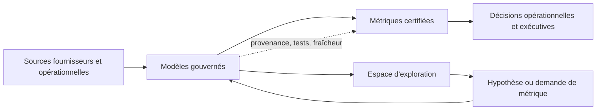

L'analytics self-service porte une promesse séduisante : donner aux équipes accès aux données, leur permettre de répondre à leurs propres questions et réduire la file d'attente devant l'équipe data.

Cette promesse échoue lorsque l'on confond « accès » et « compréhension ». Un dashboard peut se charger correctement, utiliser une requête SQL valide et communiquer malgré tout un chiffre faux. L'échec est généralement silencieux. Aucune exception n'est levée lorsqu'une jointure multiplie les lignes, qu'un fournisseur envoie des données en retard, qu'un changement de timezone modifie la journée de reporting ou que deux équipes utilisent le mot « revenu » pour désigner deux populations différentes.

Le problème ne vient pas principalement de l'outil de visualisation. Il vient de l'absence de contrat autour de la métrique.

L'analytics self-service devient fiable lorsque chacun peut explorer librement, mais que l'organisation explicite les définitions, les grains, les sources et les signaux de qualité qui peuvent être utilisés pour prendre une décision.

## Des données disponibles ne sont pas forcément des données fiables

La question « Peut-on obtenir ce chiffre ? » en contient au moins quatre :

1. Une source contient-elle des enregistrements liés à la question ?
2. Peut-on transformer ces enregistrements au grain demandé ?
3. La métrique produite est-elle définie de manière cohérente selon les consommateurs ?
4. Le résultat est-il assez récent et complet pour la décision envisagée ?

La première question concerne la disponibilité. Les autres concernent le sens et l'aptitude à l'usage.

Une table du warehouse peut être interrogeable techniquement tout en étant inadaptée à un reporting client. Un flux fournisseur brut peut être utile pour enquêter mais impropre à un KPI. Un modèle peut être correct au grain du compte et incorrect lorsqu'il est joint directement à des transactions. Le schéma ne communique pas ces frontières à lui seul.

Les erreurs analytiques les plus dangereuses ne sont donc pas les pipelines cassés. Ce sont les résultats plausibles auxquels il manque le contexte.

## Les mensonges silencieux

Certains modes de panne reviennent dans tous les systèmes self-service.

### Le mauvais grain

Chaque modèle possède un grain, qu'il le déclare ou non. Une table peut représenter une ligne par compte, par position ou par événement de valorisation. Si un utilisateur joint un attribut au niveau du compte à une table au niveau de la transaction puis agrège le résultat, la requête peut s'exécuter parfaitement tout en comptant l'attribut plusieurs fois.

La réponse sûre n'est pas de prévenir vaguement les utilisateurs de faire attention aux jointures. Il faut publier le grain dans le contrat du modèle et fournir des mesures qui le respectent.

### La dérive des définitions

« Client actif », « actifs sous gestion » et « transaction terminée » sont des définitions métier, pas des noms de colonnes. Si la définition change dans un dashboard mais pas dans un autre, l'organisation peut posséder deux vérités internes cohérentes mais incompatibles.

Le versioning est parfois nécessaire. Au minimum, une métrique possède un owner identifié, une définition, une date d'effet et les exclusions importantes.

### La fraîcheur et les données tardives

Un dashboard qui affiche « aujourd'hui » peut contenir les données fournisseur d'hier, un chargement partiel ou un mélange de snapshots pris à des instants différents. La fraîcheur n'est pas seulement une métrique technique de pipeline. Elle détermine si le chiffre convient à la décision.

Une métrique quotidienne de pilotage et un reporting de valorisation destiné à un client ne devraient pas avoir le même contrat de fraîcheur.

### Les filtres invisibles

De nombreux outils cachent des filtres dans des vues sauvegardées, des scopes par défaut ou des permissions héritées. L'utilisateur voit un chiffre sans voir quels enregistrements ont été exclus. Le dashboard devient une conclusion sans chemin inspectable vers la source.

Plus la décision est importante, plus il faut exposer directement le scope, les exclusions et les limites temporelles.

### Les écarts de réconciliation

Une métrique peut être cohérente en interne et diverger du système opérationnel à cause des mappings, du timing, des suppressions ou des corrections fournisseur. La réconciliation n'est pas une tâche de migration ponctuelle. C'est un signal continu que deux représentations du métier commencent à diverger.

## Le contrat d'une métrique

Une métrique fiable doit répondre à autre chose que « quelle est la requête SQL ? ». Son contrat devrait inclure :

| Champ | Question à laquelle il répond |
| --- | --- |
| Définition | Que signifie cette métrique dans le métier ? |
| Grain | Que représente une ligne avant agrégation ? |
| Population | Quelles entités, quels statuts et quelles périodes sont inclus ? |
| Exclusions | Quels enregistrements sont volontairement exclus, et pourquoi ? |
| Source | Quel système fait autorité pour chaque entrée ? |
| Fraîcheur | Quel âge maximal rend le chiffre impropre ? |
| Owner | Qui décide si la définition reste correcte ? |
| Réconciliation | Quel total indépendant doit correspondre ? |
| Historique | Quand la définition ou la source a-t-elle changé ? |

Ce contrat n'a pas besoin d'être un document massif. Il doit être trouvable là où la métrique est utilisée et suffisamment précis pour empêcher deux personnes raisonnables de produire des réponses différentes.

## Exploration, certification et décision

Le self-service ne signifie pas que tous les datasets possèdent le même niveau de confiance. Un système utile sépare trois modes :

- **Exploration :** les utilisateurs peuvent enquêter dans des données brutes ou légèrement modélisées, formuler des hypothèses et repérer des problèmes. Les résultats sont provisoires.
- **Certification :** les modèles et métriques possèdent des contrats déclarés, des tests, des owners, des signaux de fraîcheur et des limites connues.
- **Usage décisionnel :** un reporting, une alerte ou un workflow opérationnel consomme des métriques certifiées avec un engagement explicite.

Cette frontière ne doit pas restreindre la curiosité. Elle empêche une requête exploratoire de devenir silencieusement un fait organisationnel.

L'équipe data ne devrait pas être la seule à pouvoir interroger les données. Elle devrait posséder les contrats et les chemins balisés qui rendent l'interrogation sûre.

## À quoi sert réellement une semantic layer

On décrit souvent une semantic layer comme un moyen d'éviter de répéter du SQL. C'est utile, mais incomplet. Son rôle le plus important est de donner un sens métier partagé aux champs et aux mesures.

Elle peut définir :

- le grain canonique d'une entité ;
- les dimensions qui peuvent être combinées sans danger ;
- les filtres qui appartiennent à une métrique ;
- le lien entre un terme métier et les colonnes sources ;
- les agrégations autorisées ;
- les métadonnées de fraîcheur et de qualité exposées aux consommateurs.

Cela ne rend pas la semantic layer autoritaire par simple déclaration. Elle le devient lorsque ses définitions sont testées contre la réalité opérationnelle et que les changements ont un owner et une date d'effet.

Il faut aussi prévoir une sortie. Une métrique gouvernée incapable d'expliquer ses exceptions repoussera les utilisateurs sérieux vers le SQL brut. Le bon design permet l'exploration tout en gardant une distinction claire entre analyse personnalisée et sortie certifiée.

## La confiance est un signal, pas un badge

Un label comme « certifié » n'est utile que s'il indique ce qui a été vérifié. Une indication de confiance opérationnelle peut afficher :

- le dernier chargement réussi et la fraîcheur attendue ;
- la couverture des sources et les fournisseurs manquants connus ;
- le statut des tests et de la dernière réconciliation ;
- l'owner de la définition et la date de dernière revue ;
- la date d'effet de la définition courante ;
- les avertissements sur les périodes partielles ou les données tardives.

Cela rend l'incertitude visible sans obliger chaque utilisateur à lire un document d'implémentation.

Pour les usages à fort enjeu, le système devrait échouer fermé. Si une métrique certifiée dépasse son délai de fraîcheur ou si une réconciliation sort significativement de la tolérance, le dashboard doit signaler qu'elle n'est plus adaptée à la décision visée. Un graphique vert accompagné d'une petite réserve cachée n'est pas un contrôle qualité.

## Revue de confiance avant publication

Avant de publier largement un dashboard ou une métrique, demander :

- À quelle question exacte répond-il ?
- Quel est le grain à chaque étape de la transformation ?
- Quelle population et quelle période sont incluses ?
- Que deviennent les données tardives, manquantes, corrigées ou dupliquées ?
- Quel système fait autorité pour chaque entrée ?
- Quel total indépendant permet la réconciliation ?
- Comment le consommateur saura-t-il que la métrique est ancienne ou partielle ?
- Qui possède la définition lorsque le processus métier change ?
- Quelles conclusions sont sûres et lesquelles nécessitent une revue humaine ?

Si ces questions restent sans réponse, la sortie peut encore être précieuse pour explorer. Elle n'est pas prête à être présentée comme un fait établi.

## Le coût de la gouvernance est inférieur au coût du désaccord

Les équipes résistent parfois aux contrats de métriques parce qu'ils semblent plus lents que de laisser chaque analyste travailler indépendamment. Cette comparaison oublie le coût en aval : dashboards dupliqués, débats sur le bon chiffre, réconciliation manuelle avant les réunions et décisions prises à partir de définitions impossibles à reconstruire.

La gouvernance n'est pas utile parce qu'elle ajoute des métadonnées. Elle est utile parce qu'elle réduit le travail d'interprétation répété et rend les désaccords diagnostiquables.

Le niveau de gouvernance doit être proportionnel à la conséquence. Une requête exploratoire jetable demande peu de cérémonie. Une métrique utilisée pour le reporting de portefeuille, la communication client, les opérations financières ou une décision automatisée nécessite un contrat plus fort et un état de qualité visible.

## Les limites du self-service

Toutes les questions ne doivent pas devenir une métrique réutilisable. Certaines sont réellement exploratoires. Certaines nécessitent une nouvelle définition métier. Certaines révèlent un défaut des systèmes sources qu'aucune semantic layer ne peut réparer.

Le self-service ne peut pas non plus résoudre l'absence d'ownership. Si personne ne sait décider ce que signifie « actif », encoder la supposition d'une équipe dans un modèle ne fait que transformer l'ambiguïté en infrastructure.

Enfin, les contrôles de qualité ne peuvent pas prouver qu'une métrique représente le bon concept métier. Ils peuvent détecter les problèmes de fraîcheur, de schéma, de nullité, de doublon et de réconciliation. Il faut toujours un jugement humain lorsque le sens du métier change.

## Le chiffre est la fin d'une chaîne

Un chiffre de dashboard n'est pas un fait isolé. Il est l'aboutissement d'une chaîne de systèmes sources, transformations, définitions, filtres, limites temporelles et hypothèses.

L'analytics self-service fonctionne lorsque cette chaîne est suffisamment visible pour être utilisée correctement. Donnez aux équipes la liberté d'explorer, mais rendez le sens certifié explicite. Publiez le grain. Affichez la fraîcheur. Nommez l'owner. Réconciliez le résultat. Rendez l'incertitude visible avant qu'elle ne devienne une décision.

L'objectif n'est pas de rendre l'analytics incapable d'être faux. C'est de rendre l'erreur détectable avant qu'un chiffre plausible ne gagne de l'autorité.

## Navigation dans la série

- Partie 1 — [Les inconnus inconnus de l'architecture logicielle](../posts/unknown-unknowns-software-architecture).
- Partie 2 (actuelle) — Construire une analytics self-service qui ne ment pas.
- Partie 3 — [L'ingénierie du contexte au-delà du prompt engineering](../posts/context-engineering-beyond-prompt-engineering).
- Partie 4 — [Pourquoi la plupart des documents d'ingénierie vieillissent mal](../posts/engineering-documents-age-poorly).

À lire aussi : [Changer de casquette : du backend à la data chez RockFi](../posts/backend-to-data-engineer-rockfi) et [Les inconnus inconnus de l'architecture logicielle](../posts/unknown-unknowns-software-architecture).
