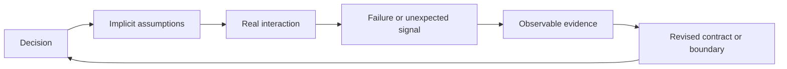

Software architecture is usually presented as a problem of making the right decisions with incomplete information. That is true, but incomplete information is not the hardest part. The harder problem is that some of the information does not exist yet.

You can list the decisions you have not made. You can create a spike for a technology you do not understand. You can mark a dependency as risky. The dangerous category is different: the assumptions, interactions, and failure modes that are absent from the team's mental model entirely.

Those are the unknown unknowns.

They are not a mystical category of failure. They are ordinary system properties that become visible only when a boundary is crossed: more tenants, a different provider, a deploy during a traffic spike, a new data grain, a partial outage, or a new operator using a workflow in a way nobody expected.

The practical consequence is important: architecture cannot eliminate unknown unknowns. It can only make them cheaper to discover.

## The four levels of architectural knowledge

The familiar matrix is useful because it separates four very different engineering situations:

| Category | What the team has | The correct response |
| --- | --- | --- |
| Known knowns | A tested understanding of the behaviour | Encode it in contracts and tests |
| Known unknowns | A named question or risk | Investigate it before committing |
| Unknown knowns | Experience or evidence that exists elsewhere | Find it and make it explicit |
| Unknown unknowns | A behaviour outside the current model | Create signals and safe recovery paths |

The third category is easy to miss. A team may already possess the answer in an incident report, a provider limitation, an old migration, or the memory of a person who left. The answer is not operational knowledge until the system and the team can access it at the moment it matters.

The fourth category is why architecture documents should not be judged only by how complete they look. A diagram can accurately represent the intended request flow while hiding the queue that fills during a provider slowdown, the retry policy that duplicates side effects, or the permission boundary that disappears when an agent receives a broader token.

The diagram is not false. It is incomplete in a way that matters.

## Why architecture diagrams create false confidence

A system diagram normally shows stable nouns: services, databases, queues, APIs, and users. Production failures often arise from verbs and conditions instead:

- a client retries while the original request is still executing;
- an event arrives after the record it references has been deleted;
- a load balancer closes an idle connection without either application noticing immediately;
- a provider returns a valid response with an incomplete business meaning;
- a deployment changes one side of a contract before the other side has drained;
- an operator replays an event because the first attempt produced no visible result.

These behaviours are not separate from the architecture. They are the architecture under time, failure, and concurrency.

The useful question is therefore not only “What calls what?” It is also:

> What can happen when this call is delayed, duplicated, reordered, partially applied, or interpreted differently by the other side?

That question changes the design review. It moves attention from boxes and arrows to contracts, state transitions, ownership, and recovery.

## The production system is larger than the designed system

In a real system, the architecture includes more than the code path that successfully handles the happy case. It includes:

- the queues and retry policies that absorb pressure;
- the timeouts and connection pools that turn latency into failure;
- the operational permissions that determine who can recover a bad state;
- the dashboards that decide whether an incident is visible;
- the runbooks and documents that shape the next human action;
- the provider behaviour that is outside the team's control;
- the historical data and migrations that the current model inherited.

This is why a small architectural decision can acquire a much larger blast radius. A single shared in-memory system may start as a convenient cache and later become a queue, session store, and rate limiter. A single semantic definition may be reused in a dashboard, an operational alert, and a client-facing report. A single context loader may grant an agent access to data that was never intended to cross a boundary.

The original decision did not necessarily look unreasonable. The unknown was the set of future roles the component would accumulate.

The goal is not to predict every future role. The goal is to make role expansion visible before the failure becomes systemic.

## A design response: reduce, isolate, detect, recover

There is no universal checklist for unknown unknowns, but four design moves are consistently useful.

### Reduce

Reduce the number of assumptions required for a change to be safe.

Prefer explicit contracts over convention. Prefer a typed boundary over a shared object whose meaning changes by caller. Prefer an idempotent operation over an operation that depends on exactly-once delivery. Prefer a small, reversible migration over a single step that changes storage, code, and consumers at once.

Reduction is not about making the system simple in the abstract. It is about reducing the number of hidden conditions that must remain true at the same time.

### Isolate

Separate failure domains when the consequences are different.

Caching, authentication, and job execution may all use the same infrastructure technology, but they do not have the same data lifecycle or availability requirement. Exploration and certified analytics may read the same warehouse, but they should not share the same trust label. An agent that drafts a recommendation should not automatically have the authority to publish it.

Isolation limits the blast radius when a previously invisible interaction becomes visible.

### Detect

Add signals for the assumptions you cannot prove statically.

Useful signals include queue age, retry counts, deduplication ratios, freshness lag, rejected contract versions, permission denials, saturation, and reconciliation differences. A metric is valuable when it tells the team which assumption is no longer holding.

“The service is up” is rarely enough. The important question is whether the business invariant is still true.

### Recover

Design the failure path before the failure exists.

Recovery may mean replaying an event, rebuilding a projection, rolling back a feature flag, revoking a credential, quarantining a record, or asking a human to decide. The right mechanism depends on the domain, but the invariant is the same: discovery must not require an irreversible guess.

## Reversibility is an architectural control

Teams often discuss reversibility as a delivery concern: can we roll back the deploy? It is also a way to manage unknowns.

A reversible decision keeps the cost of being wrong bounded. Feature flags, additive schema changes, shadow reads, dual writes with reconciliation, versioned events, and staged rollouts all create opportunities to learn before the final commitment.

Not every decision should be made reversible. Financial records, audit evidence, and security actions may require immutability rather than rollback. In those cases, the surrounding workflow needs stronger validation and a compensating process rather than an attempt to erase history.

The distinction matters. “We can roll it back” is not a valid safety argument if the system has already emitted irreversible side effects.

## What failure teaches that design cannot

Some unknowns can only be discovered through operation. The response should be to turn the discovery into an asset instead of treating the incident as an isolated surprise.

After an incident or unexpected behaviour, capture at least four things:

1. Which assumption failed?
2. Where should that assumption have been visible?
3. Which boundary allowed the impact to spread?
4. What evidence would have shortened detection or recovery?

This is more useful than simply recording the final fix. A fix that changes one timeout may close one path while leaving the class of failure untouched. A better outcome is a new invariant, signal, contract, or ownership rule that prevents the same blind spot from returning in a different form.

The Redis memory incident described in the existing post-mortem is a good example of this distinction. The immediate issue was memory exhaustion. The architectural lesson was that unrelated lifecycles had been allowed to share one failure domain. The durable response was isolation, lifecycle discipline, and monitoring—not merely a larger instance.

## A review checklist for unknown unknowns

Before committing to an architecture, ask:

- Which assumptions are required for the happy path to remain safe?
- Which behaviour is controlled by a provider, proxy, queue, clock, or operator?
- What happens when requests are duplicated, delayed, reordered, or partially applied?
- Which component can silently accumulate another responsibility?
- Which business invariant should we monitor instead of only monitoring availability?
- What is reversible, and what creates irreversible side effects?
- Can we isolate the failure domain before we understand every failure mode?
- What is the smallest experiment that could expose a dangerous assumption?
- Who owns detection, decision, and recovery?

The checklist does not make the unknown known in advance. It makes the system better at learning.

## Limits of the model

Unknown unknowns are not an excuse for endless analysis. A team that treats every possibility as equally important will never ship. The correct response is proportionality: identify the assumptions with the largest blast radius, make those observable, and accept bounded uncertainty elsewhere.

Nor is observability a substitute for good design. A perfectly monitored shared failure domain is still a shared failure domain. Signals reduce detection time; they do not remove coupling.

Finally, not every production surprise is an architectural failure. Requirements change, vendors fail, and humans make mistakes. The test is whether the system made the surprise unnecessarily expensive and whether the organization learned something reusable from it.

## The point is not prediction

Architecture is often described as the art of deciding before implementation. In production systems, it is also the art of creating the conditions for correction after implementation.

You will not enumerate every interaction. You will not know every future consumer. You will not predict every provider behaviour or operator action. You can still design boundaries, contracts, signals, and recovery paths that keep new information from becoming a catastrophe.

The strongest architecture is not the one that claims to know everything. It is the one that makes not knowing survivable.

## Series navigation

- Part 1 (current) — Unknown Unknowns in Software Architecture.
- Part 2 — [Building Self-Service Analytics That Doesn't Lie](../posts/self-service-analytics-that-doesnt-lie).
- Part 3 — [Context Engineering Beyond Prompt Engineering](../posts/context-engineering-beyond-prompt-engineering).
- Part 4 — [Why Most Engineering Documents Age Poorly](../posts/engineering-documents-age-poorly).

Related reading: [The Day Redis Reached its Limits](../posts/redis-memory-exhaustion-post-mortem), [Why We Chose Server-Sent Events](../posts/architecture-sse-agent-communication), and [Idempotency and Debounce in BullMQ](../posts/idempotency-debounce-jobify-bullmq).
