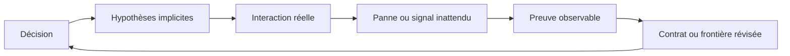

On présente souvent l'architecture logicielle comme le problème de prendre les bonnes décisions avec une information incomplète. C'est vrai, mais l'information incomplète n'est pas la partie la plus difficile. Le vrai problème est qu'une partie de l'information n'existe pas encore.

On peut lister les décisions qui n'ont pas été prises. On peut créer un spike pour une technologie que l'on ne maîtrise pas. On peut déclarer une dépendance risquée. La catégorie dangereuse est différente : ce sont les hypothèses, les interactions et les modes de panne qui n'existent même pas dans le modèle mental de l'équipe.

Ce sont les inconnus inconnus.

Il ne s'agit pas d'une catégorie mystérieuse de défaillance. Ce sont des propriétés ordinaires du système qui deviennent visibles uniquement lorsqu'une frontière est franchie : davantage de tenants, un fournisseur différent, un déploiement pendant un pic de trafic, un nouveau grain de données, une panne partielle ou un nouvel opérateur qui utilise le workflow d'une manière que personne n'avait prévue.

La conséquence pratique est importante : l'architecture ne peut pas éliminer les inconnus inconnus. Elle peut seulement rendre leur découverte moins coûteuse.

## Les quatre niveaux de connaissance architecturale

La matrice habituelle est utile parce qu'elle sépare quatre situations d'ingénierie très différentes :

| Catégorie | Ce que l'équipe possède | Réponse appropriée |
| --- | --- | --- |
| Connus connus | Une compréhension testée du comportement | L'encoder dans des contrats et des tests |
| Connus inconnus | Une question ou un risque nommé | L'investiguer avant de s'engager |
| Inconnus connus | Une expérience ou une preuve existe ailleurs | La retrouver et la rendre explicite |
| Inconnus inconnus | Un comportement hors du modèle actuel | Créer des signaux et des chemins de récupération sûrs |

La troisième catégorie est facile à manquer. Une équipe possède peut-être déjà la réponse dans un rapport d'incident, une limitation fournisseur, une ancienne migration ou la mémoire d'une personne qui est partie. Cette réponse n'est pas encore une connaissance opérationnelle tant que le système et l'équipe ne peuvent pas y accéder au moment où elle devient utile.

La quatrième catégorie explique pourquoi un document d'architecture ne devrait pas être jugé uniquement sur son apparence de complétude. Un diagramme peut représenter correctement le chemin nominal tout en masquant la queue qui se remplit pendant un ralentissement fournisseur, la politique de retry qui duplique les effets de bord ou la frontière de permission qui disparaît lorsqu'un agent reçoit un token trop large.

Le diagramme n'est pas faux. Il est incomplet d'une manière qui compte.

## Pourquoi les diagrammes créent une fausse confiance

Un diagramme représente généralement des noms stables : services, bases de données, queues, APIs et utilisateurs. Les incidents de production viennent souvent plutôt des verbes et des conditions :

- un client réessaie alors que la requête originale s'exécute encore ;
- un événement arrive après la suppression de l'enregistrement qu'il référence ;
- un load balancer ferme une connexion inactive sans que l'application ne le sache immédiatement ;
- un fournisseur renvoie une réponse valide dont le sens métier est incomplet ;
- un déploiement modifie un côté d'un contrat avant que l'autre côté ait fini de se vider ;
- un opérateur rejoue un événement parce que la première tentative n'a produit aucun résultat visible.

Ces comportements ne sont pas séparés de l'architecture. Ils sont l'architecture soumise au temps, aux pannes et à la concurrence.

La bonne question n'est donc pas seulement « qui appelle qui ? ». Il faut aussi demander :

> Que se passe-t-il si cet appel est retardé, dupliqué, réordonné, partiellement appliqué ou interprété différemment par l'autre côté ?

Cette question change la revue de conception. Elle déplace l'attention des boîtes et des flèches vers les contrats, les transitions d'état, l'ownership et la récupération.

## Le système en production est plus grand que le système conçu

Dans un vrai système, l'architecture inclut davantage que le chemin de code qui traite correctement le cas nominal. Elle inclut :

- les queues et les politiques de retry qui absorbent la pression ;
- les timeouts et les pools de connexions qui transforment la latence en panne ;
- les permissions opérationnelles qui déterminent qui peut réparer un état dégradé ;
- les dashboards qui décident si un incident est visible ;
- les runbooks et les documents qui orientent la prochaine action humaine ;
- le comportement des fournisseurs que l'équipe ne contrôle pas ;
- les données historiques et les migrations héritées par le modèle actuel.

C'est pourquoi une petite décision d'architecture peut acquérir un blast radius beaucoup plus large. Un même système in-memory peut commencer comme un cache pratique puis devenir une queue, un stockage de sessions et un mécanisme de rate limiting. Une définition sémantique peut être réutilisée dans un dashboard, une alerte opérationnelle et un reporting client. Un chargeur de contexte peut donner à un agent accès à des données qui n'auraient jamais dû franchir une frontière.

La décision initiale n'était pas forcément déraisonnable. L'inconnu était l'ensemble des rôles futurs que le composant allait accumuler.

L'objectif n'est pas de prédire chacun de ces rôles. Il est de rendre leur apparition visible avant que l'interaction ne devienne systémique.

## Une réponse de conception : réduire, isoler, détecter, récupérer

Il n'existe pas de checklist universelle des inconnus inconnus, mais quatre mouvements de conception sont presque toujours utiles.

### Réduire

Réduire le nombre d'hypothèses nécessaires pour qu'un changement reste sûr.

Préférer un contrat explicite à une convention. Préférer une frontière typée à un objet partagé dont le sens change selon l'appelant. Préférer une opération idempotente à une opération qui dépend d'une livraison exactement une fois. Préférer une migration additive et réversible à une étape unique qui modifie simultanément le stockage, le code et les consommateurs.

Il ne s'agit pas de rendre le système abstraitement simple. Il s'agit de réduire le nombre de conditions cachées qui doivent rester vraies en même temps.

### Isoler

Séparer les failure domains lorsque les conséquences sont différentes.

Le cache, l'authentification et l'exécution de jobs peuvent utiliser la même technologie d'infrastructure sans avoir le même cycle de vie ni le même objectif de disponibilité. L'exploration et les métriques certifiées peuvent lire le même warehouse sans avoir le même niveau de confiance. Un agent qui prépare une recommandation ne devrait pas automatiquement avoir le droit de la publier.

L'isolation limite le blast radius lorsqu'une interaction jusque-là invisible devient visible.

### Détecter

Ajouter des signaux pour les hypothèses que l'on ne peut pas prouver statiquement.

Les signaux utiles incluent l'âge des messages en queue, le nombre de retries, le ratio de déduplication, le retard de fraîcheur, les versions de contrat rejetées, les refus de permission, la saturation et les écarts de réconciliation. Une métrique est utile lorsqu'elle indique quelle hypothèse n'est plus respectée.

« Le service est disponible » ne suffit presque jamais. La vraie question est de savoir si l'invariant métier est encore vrai.

### Récupérer

Concevoir le chemin de panne avant que la panne n'existe.

La récupération peut consister à rejouer un événement, reconstruire une projection, désactiver une feature flag, révoquer une credential, mettre un enregistrement en quarantaine ou demander une décision humaine. Le mécanisme dépend du domaine, mais l'invariant reste le même : la découverte ne doit pas obliger à faire un choix irréversible à l'aveugle.

## La réversibilité est un contrôle architectural

On parle souvent de réversibilité comme d'un sujet de delivery : peut-on rollback le déploiement ? C'est aussi une manière de gérer les inconnus.

Une décision réversible limite le coût d'une erreur. Feature flags, migrations additives, shadow reads, dual writes avec réconciliation, événements versionnés et déploiements progressifs créent des occasions d'apprendre avant l'engagement final.

Toutes les décisions ne doivent pas être réversibles. Les écritures financières, les preuves d'audit et les actions de sécurité peuvent exiger l'immutabilité plutôt qu'un rollback. Dans ce cas, le workflow autour de l'action doit intégrer une validation plus forte et un processus compensatoire au lieu d'essayer d'effacer l'historique.

La distinction compte. « On pourra rollback » n'est pas un argument de sécurité si le système a déjà produit des effets de bord irréversibles.

## Ce que les incidents apprennent que la conception ne peut pas prévoir

Certains inconnus ne peuvent être découverts qu'en production. La réponse doit transformer cette découverte en actif plutôt que traiter l'incident comme une surprise isolée.

Après un incident ou un comportement inattendu, documenter au moins quatre éléments :

1. Quelle hypothèse a échoué ?
2. Où cette hypothèse aurait-elle dû être visible ?
3. Quelle frontière a permis à l'impact de se propager ?
4. Quelle preuve aurait raccourci la détection ou la récupération ?

Ce travail est plus utile que la simple description du correctif final. Modifier un timeout peut fermer un chemin tout en laissant la classe de panne intacte. Un meilleur résultat est un nouvel invariant, signal, contrat ou ownership qui empêche le même angle mort de réapparaître sous une autre forme.

Le post-mortem Redis du blog illustre bien cette distinction. Le problème immédiat était l'épuisement mémoire. La leçon architecturale était que des cycles de vie indépendants partageaient le même failure domain. La réponse durable était l'isolation, la discipline de cycle de vie et le monitoring — pas seulement une instance plus grande.

## Checklist de revue

Avant de s'engager sur une architecture, demander :

- Quelles hypothèses sont nécessaires pour que le chemin nominal reste sûr ?
- Quel comportement dépend d'un fournisseur, d'un proxy, d'une queue, de l'horloge ou d'un opérateur ?
- Que se passe-t-il si les requêtes sont dupliquées, retardées, réordonnées ou partiellement appliquées ?
- Quel composant peut silencieusement accumuler une nouvelle responsabilité ?
- Quel invariant métier faut-il surveiller plutôt que surveiller seulement la disponibilité ?
- Qu'est-ce qui est réversible et qu'est-ce qui produit des effets irréversibles ?
- Peut-on isoler le failure domain avant de connaître tous les modes de panne ?
- Quelle expérience minimale pourrait révéler une hypothèse dangereuse ?
- Qui possède la détection, la décision et la récupération ?

Cette checklist ne rend pas l'inconnu connu à l'avance. Elle rend le système meilleur pour apprendre.

## Limites du modèle

Les inconnus inconnus ne justifient pas une analyse infinie. Une équipe qui traite chaque possibilité comme également importante ne livrera jamais. La réponse doit être proportionnée : identifier les hypothèses au plus grand blast radius, les rendre observables et accepter une incertitude bornée ailleurs.

L'observabilité ne remplace pas non plus une bonne conception. Un failure domain partagé et parfaitement monitoré reste partagé. Les signaux réduisent le temps de détection ; ils ne suppriment pas le couplage.

Enfin, toute surprise de production n'est pas une faute d'architecture. Les exigences changent, les fournisseurs tombent et les humains se trompent. La vraie question est de savoir si le système a rendu la surprise inutilement coûteuse et si l'organisation en a tiré un apprentissage réutilisable.

## Le sujet n'est pas la prédiction

On décrit souvent l'architecture comme l'art de décider avant l'implémentation. Dans un système de production, c'est aussi l'art de créer les conditions d'une correction après l'implémentation.

On ne listera pas chaque interaction. On ne connaîtra pas chaque futur consommateur. On ne prédira pas chaque comportement fournisseur ni chaque action opérateur. On peut tout de même concevoir des frontières, des contrats, des signaux et des chemins de récupération qui empêchent une nouvelle information de devenir une catastrophe.

La meilleure architecture n'est pas celle qui prétend tout savoir. C'est celle qui rend le fait de ne pas savoir supportable.

## Navigation dans la série

- Partie 1 (actuelle) — Les inconnus inconnus de l'architecture logicielle.
- Partie 2 — [Construire une analytics self-service qui ne ment pas](../posts/self-service-analytics-that-doesnt-lie).
- Partie 3 — [L'ingénierie du contexte au-delà du prompt engineering](../posts/context-engineering-beyond-prompt-engineering).
- Partie 4 — [Pourquoi la plupart des documents d'ingénierie vieillissent mal](../posts/engineering-documents-age-poorly).

À lire aussi : [Le jour où Redis a atteint ses limites](../posts/redis-memory-exhaustion-post-mortem), [Pourquoi nous avons choisi les Server-Sent Events](../posts/architecture-sse-agent-communication) et [Idempotence et debounce avec BullMQ](../posts/idempotency-debounce-jobify-bullmq).
